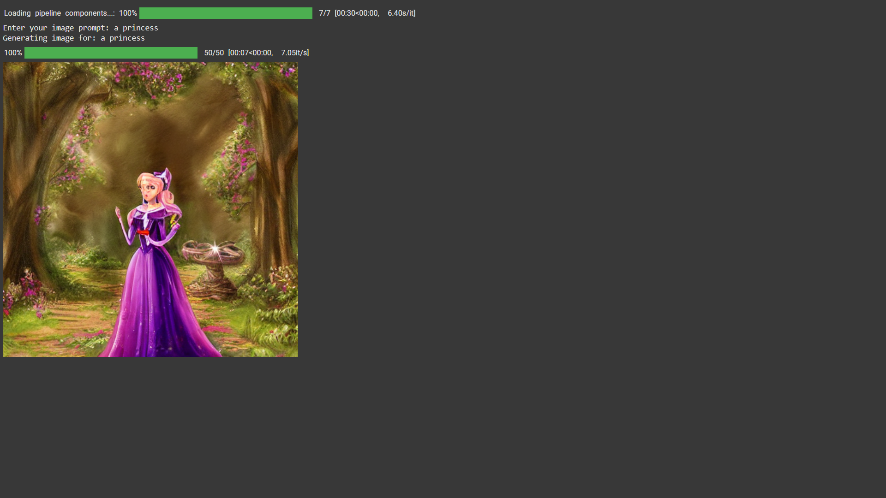

# PRODIGY_GA_02
Image Generation using with pre-trained generative models
# 🧠 Stable Diffusion Image Generator
# 🧠 Stable Diffusion Image Generator

Generate stunning images from text prompts using Stable Diffusion v1.5 and 🤗 Diffusers.

## 🚀 How to Use
Click the badge above to open the notebook in Google Colab.  
Enter your prompt when asked, and the image will be generated, displayed, and downloaded automatically.

## 📦 Project Structure
- `generate_image.ipynb`: Main notebook to run the generator
- `requirements.txt`: Python dependencies
- `LICENSE`: Open-source license (MIT)
- `assets/example_output.png`: Sample output screenshot

## 🖼️ Example Output
  
*Generated using the prompt: "A futuristic cityscape at sunset"*

## 📝 License
This project is licensed under the MIT License.
